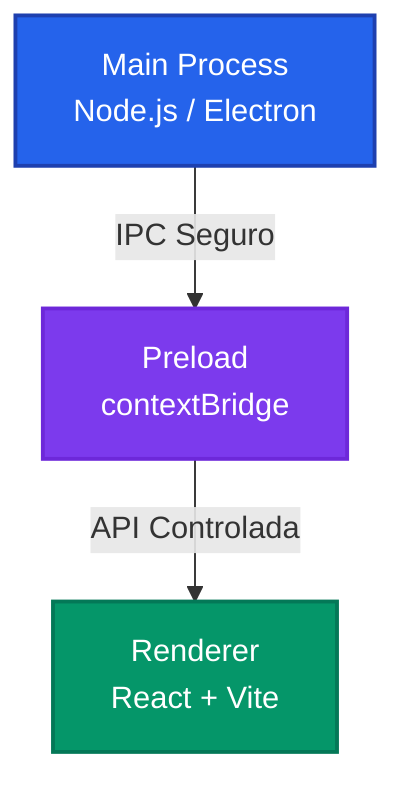
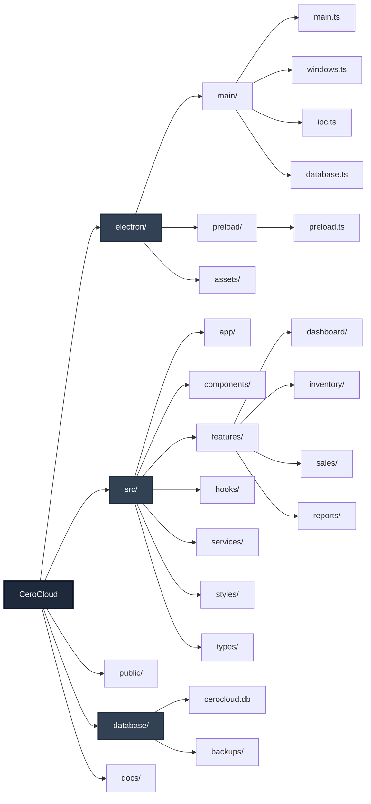
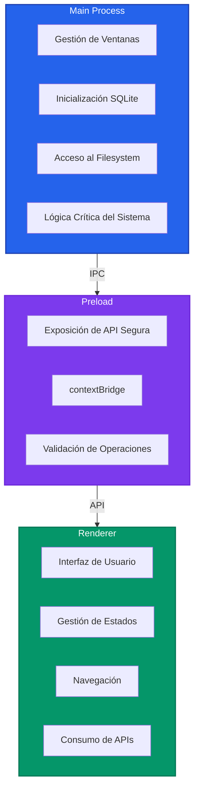
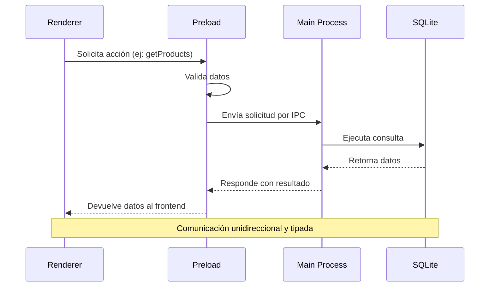
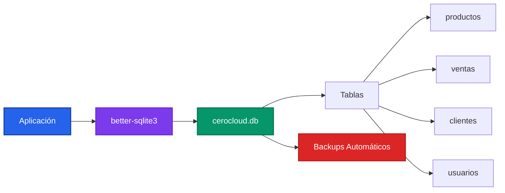
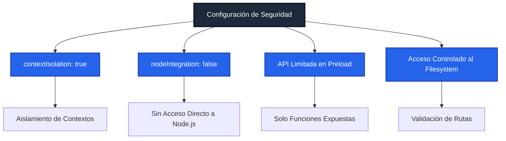
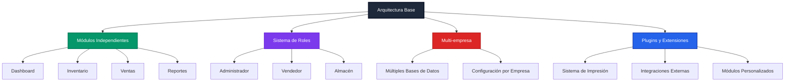

# Arquitectura y Estructura del Proyecto

**Proyecto:** CeroCloud  
**Stack:** Electron + Vite + React + TypeScript + SQLite  
**Objetivo:** Base sólida, escalable y mantenible para una aplicación de escritorio 100% local.

---

## 1. Arquitectura General

El proyecto sigue la arquitectura estándar de **Electron** separando responsabilidades en tres capas:

- **Main Process**: Control del ciclo de vida de la app, ventanas, filesystem y base de datos.
- **Preload**: Capa segura de comunicación entre Electron y el frontend.
- **Renderer**: Interfaz de usuario (React).

Esta separación garantiza **seguridad**, **escalabilidad** y **mantenibilidad**.



---

## 2. Estructura de Carpetas



---

## 3. Responsabilidades por Capa



### Main Process (electron/main)
- Crear y gestionar ventanas.
- Inicializar SQLite.
- Acceso al filesystem (imágenes, backups).
- Lógica crítica del sistema.

### Preload (electron/preload)
- Exponer funciones seguras mediante `contextBridge`.
- Evitar acceso directo a Node.js desde el frontend.

Ejemplo de responsabilidades:
- `getProducts()`
- `createSale()`
- `backupDatabase()`

### Renderer (src)
- Renderizado de la interfaz.
- Manejo de estados y navegación.
- Consumo de APIs expuestas por preload.

---

## 4. Comunicación IPC



- Uso exclusivo de canales definidos.
- Validación de datos antes de ejecutar operaciones.
- Comunicación unidireccional y tipada.

---

## 5. Sistema de Respaldo y Protección (V1.0.0)

El sistema de backups no es solo una funcionalidad, es un subsistema crítico con su propia arquitectura de flujo de datos.

```mermaid
graph TD
    User[Usuario] -->|Solicita Backup| Wizard[BackupWizard UI]
    Wizard -->|Selecciona Datos| Service[ZipBackupService]
    
    subgraph Core Logic
        Service -->|1. Recolecta JSONs| Data[Datos en Memoria]
        Service -->|2. Aplica AES-256 (Opcional)| Crypto[SecureEncryptionService]
        Crypto -->|3. Genera ZIP| JSZip[JSZip Engine]
    end
    
    JSZip -->|4. Blob .cerobak| FileSaver
    FileSaver -->|Descarga Local| HDD[Disco Local]
    
    HDD -.->|Subida Manual| Cloud[Google Drive / Dropbox]
    
    style User fill:#1e293b,color:#fff
    style Wizard fill:#059669,color:#fff
    style Service fill:#7c3aed,color:#fff
    style Crypto fill:#dc2626,color:#fff
```

### Componentes Clave
1.  **BackupWizard/RestoreWizard**: Controladores de UI que gestionan el estado del proceso y las animaciones.
2.  **ZipBackupService**: Orquestador que coordina la recolección de datos, compresión y generación de archivos.
3.  **SecureEncryptionService**: Módulo aislado encargado exclusivamente de la criptografía (PBKDF2 + AES-GCM).

---

## 6. Base de Datos



- SQLite como motor local.
- Archivo único `.db`.
- Acceso sincronizado mediante `better-sqlite3`.
- Backups automáticos configurables por el usuario.

---

## 6. Seguridad



---

## 7. Escalabilidad



La arquitectura permite:
- Agregar módulos sin afectar el core.
- Incorporar roles de usuario.
- Soportar múltiples empresas.
- Integrar impresión o plugins futuros.

---

Este documento define la base estructural del proyecto y sirve como referencia para el desarrollo continuo de **CeroCloud**.