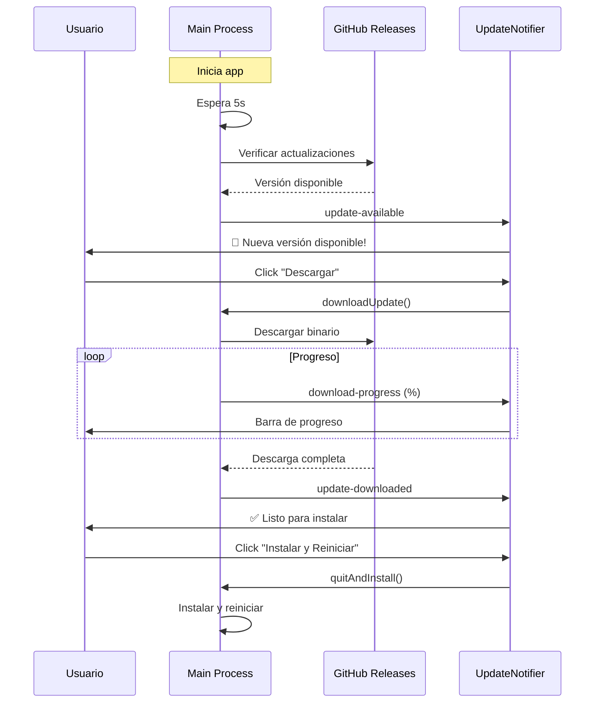

# 🔄 Sistema de Auto-Actualización - CeroCloud

**Implementado:** 8 de Enero 2026  
**Versión:** 1.1.0

---

## 📋 Índice

1. [Descripción General](#-descripción-general)
2. [Arquitectura](#-arquitectura)
3. [Configuración](#-configuración)
4. [Flujo de Usuario](#-flujo-de-usuario)
5. [Desarrollo y Testing](#-desarrollo-y-testing)
6. [Deployment](#-deployment)
7. [Troubleshooting](#-troubleshooting)

---

## 🎯 Descripción General

CeroCloud implementa un **sistema de auto-actualización silencioso y no intrusivo** que:

- ✅ **Verificación automática** cada 6 horas
- ✅ **Descarga en segundo plano** sin interrumpir al usuario
- ✅ **Notificaciones elegantes** usando Sonner toasts
- ✅ **Barra de progreso visual** con animaciones Framer Motion
- ✅ **Instalación al cerrar** la aplicación (no forzada)
- ✅ **GitHub Releases** como fuente de actualizaciones
- ✅ **Multiplataforma** (Windows, macOS, Linux)

### Tecnologías Utilizadas

- **electron-updater** - Sistema de auto-actualización oficial de Electron
- **GitHub Releases** - Hosting de binarios y changelog
- **electron-builder** - Generación de instaladores con firma digital

---

## 🏗️ Arquitectura

### Componentes

```
┌─────────────────────────────────────────────┐
│         MAIN PROCESS (Electron)             │
│  ┌───────────────────────────────────────┐  │
│  │  autoUpdater.ts (AutoUpdateService)   │  │
│  │  - Configuración electron-updater     │  │
│  │  - Event listeners                    │  │
│  │  - IPC handlers                       │  │
│  │  - Verificación periódica             │  │
│  └─────────────┬─────────────────────────┘  │
│                │ IPC                         │
└────────────────┼─────────────────────────────┘
                 │
┌────────────────▼─────────────────────────────┐
│         PRELOAD SCRIPT                       │
│  - Exposición de APIs seguras (updater.*)   │
│  - contextBridge.exposeInMainWorld()        │
└────────────────┬─────────────────────────────┘
                 │
┌────────────────▼─────────────────────────────┐
│         RENDERER PROCESS (React)             │
│  ┌───────────────────────────────────────┐  │
│  │  updaterService.ts                    │  │
│  │  - Wrapper de APIs                    │  │
│  │  - Sistema de subscripción            │  │
│  └─────────────┬─────────────────────────┘  │
│                │                             │
│  ┌─────────────▼─────────────────────────┐  │
│  │  UpdateNotifier.tsx                   │  │
│  │  - Toasts de notificación             │  │
│  │  - Barra de progreso flotante         │  │
│  │  - Botones de acción                  │  │
│  └───────────────────────────────────────┘  │
└─────────────────────────────────────────────┘
```

### Flujo de Datos



---

## ⚙️ Configuración

### 1. Configuración de GitHub Releases

El auto-updater está configurado en `electron/main/autoUpdater.ts`:

```typescript
autoUpdater.setFeedURL({
    provider: 'github',
    owner: 'CeroCloud',
    repo: 'CeroCloud-Desktop',
})
```

### 2. Variables de Entorno

Para producción, el auto-updater necesita un **GitHub Personal Access Token** (opcional para repos públicos):

```bash
# .env (solo para testing local de releases)
GH_TOKEN=ghp_your_token_here
```

### 3. Configuración de electron-builder

En `package.json`, la configuración de publishing:

```json
{
  "build": {
    "publish": {
      "provider": "github",
      "releaseType": "release"
    }
  }
}
```

### 4. Intervalo de Verificación

Por defecto, la app verifica cada **6 horas**. Para cambiar:

```typescript
// En main.ts (línea ~80)
autoUpdateService.startAutoCheck(12) // Verificar cada 12 horas
```

O desde el frontend:

```typescript
await updaterService.setAutoCheck(true, 12)
```

---

## 👤 Flujo de Usuario

### Experiencia del Usuario Final

#### 1️⃣ **Verificación Silenciosa**
- La app verifica actualizaciones al inicio (después de 5s)
- Verificaciones automáticas cada 6 horas
- **No interrumpe** el trabajo del usuario

#### 2️⃣ **Notificación de Actualización Disponible**
```
🎉 ¡Nueva versión 1.2.0 disponible!

[Descargar]  [✕]
```
- Toast no intrusivo en esquina superior derecha
- Usuario puede ignorarlo y continuar trabajando
- No expira automáticamente (duration: Infinity)

#### 3️⃣ **Descarga en Segundo Plano**
Usuario hace click en "Descargar" → Aparece barra flotante:

```
┌─────────────────────────────────┐
│ 📥 Descargando actualización    │
│ v1.2.0                       ⏳ │
│                                 │
│ ██████████░░░░░░░░ 65.3%       │
│ 32.1MB / 49.2MB                │
│ 2.45 MB/s                      │
└─────────────────────────────────┘
```

- Barra de progreso animada
- Velocidad de descarga en tiempo real
- Usuario puede seguir usando la app normalmente

#### 4️⃣ **Instalación**
Cuando la descarga termina:

```
✅ Actualización 1.2.0 descargada

[Instalar y Reiniciar]  [✕]
```

- Usuario decide **cuándo** instalar
- Al hacer click → Cierra la app e instala
- **Reabrirá automáticamente** con la nueva versión

---

## 🛠️ Desarrollo y Testing

### Testing Local

#### 1. **Simular nueva versión**

```bash
# 1. Incrementar versión en package.json
"version": "1.0.1"

# 2. Build de la app
npm run build:win

# 3. Crear release en GitHub con tag v1.0.1
# 4. Subir el .exe generado como asset del release
```

#### 2. **Testing en desarrollo**

El auto-updater **NO funciona en modo desarrollo** (`npm run dev`). Solo funciona en builds empaquetados.

```typescript
// En main.ts, solo se activa en producción:
if (app.isPackaged && mainWindow) {
    autoUpdateService = new AutoUpdateService(mainWindow)
    autoUpdateService.startAutoCheck(6)
}
```

#### 3. **Logs de debugging**

Los logs se guardan en:
- **Windows**: `%USERPROFILE%\AppData\Roaming\cerocloud\logs\main.log`
- **macOS**: `~/Library/Logs/cerocloud/main.log`
- **Linux**: `~/.config/cerocloud/logs/main.log`

Ver logs en tiempo real:

```bash
# Windows
Get-Content "$env:APPDATA\cerocloud\logs\main.log" -Tail 50 -Wait

# macOS/Linux
tail -f ~/Library/Logs/cerocloud/main.log
```

---

## 🚀 Deployment

### Proceso de Release

#### 1. **Preparar nueva versión**

```bash
# 1. Actualizar version en package.json
npm version minor  # 1.0.0 → 1.1.0
# o
npm version patch  # 1.0.0 → 1.0.1

# 2. Actualizar CHANGELOG.md
# 3. Commit y push
git add .
git commit -m "chore: release v1.1.0"
git push origin main
```

#### 2. **Crear GitHub Release**

```bash
# Opción A: Manual en GitHub UI
# 1. Ir a https://github.com/CeroCloud/CeroCloud-Desktop/releases
# 2. Click "Draft a new release"
# 3. Crear tag (ej: v1.1.0)
# 4. Escribir release notes
# 5. Subir binarios (.exe, .dmg, .AppImage)

# Opción B: Automatizado con gh CLI
gh release create v1.1.0 \
  --title "v1.1.0 - Completitud" \
  --notes-file changelog.md \
  release/CeroCloud\ Setup\ 1.1.0.exe
```

#### 3. **Build multiplataforma**

```bash
# Windows
npm run build:win

# macOS (requiere macOS)
npm run build:mac

# Linux
npm run build:linux
```

### Assets Requeridos en Release

Para que el auto-updater funcione, el release **DEBE** incluir:

**Windows:**
- `CeroCloud-Setup-1.1.0.exe` (instalador NSIS)
- `latest.yml` (metadata, generado automáticamente por electron-builder)

**macOS:**
- `CeroCloud-1.1.0.dmg`
- `latest-mac.yml`

**Linux:**
- `CeroCloud-1.1.0.AppImage`
- `latest-linux.yml`

### CI/CD Automático (GitHub Actions)

Crear `.github/workflows/release.yml`:

```yaml
name: Build and Release

on:
  push:
    tags:
      - 'v*'

jobs:
  release:
    runs-on: ${{ matrix.os }}
    strategy:
      matrix:
        os: [windows-latest, macos-latest, ubuntu-latest]

    steps:
      - uses: actions/checkout@v3
      - uses: actions/setup-node@v3
        with:
          node-version: 20

      - run: npm ci
      - run: npm run build
        env:
          GH_TOKEN: ${{ secrets.GITHUB_TOKEN }}
```

---

## 🔧 Troubleshooting

### Problemas Comunes

#### 1. **"No hay actualizaciones" aunque hay release nuevo**

**Causas:**
- La versión en `package.json` no se incrementó
- El tag del release no sigue formato semver (`v1.0.0`)
- Los assets `.yml` no se subieron al release

**Solución:**
```bash
# Verificar versión
npm version

# Verificar tag
git describe --tags

# Re-generar release
npm run build
```

#### 2. **Error "Cannot find latest.yml"**

**Causa:** electron-builder no generó los archivos de metadata.

**Solución:**
```bash
# Asegurar que build.publish está configurado en package.json
npm run build -- --publish never
# Esto genera los .yml sin publicar
```

#### 3. **"Update check failed" en logs**

**Causa:** Problema de red o configuración de GitHub.

**Solución:**
```bash
# Verificar conectividad
curl -I https://api.github.com/repos/CeroCloud/CeroCloud-Desktop/releases/latest

# Verificar configuración en autoUpdater.ts
# owner: 'CeroCloud'
# repo: 'CeroCloud-Desktop'
```

#### 4. **Actualización descarga pero no instala**

**Causa:** Permisos insuficientes (Windows UAC, macOS Gatekeeper).

**Solución:**
- **Windows:** Firmar el .exe con certificado de código
- **macOS:** Notarizar la app con Apple Developer ID

---

## 📊 Métricas y Monitoreo

### Eventos que se pueden trackear

```typescript
updaterService.subscribe((status) => {
    // Enviar a analytics
    analytics.track('UpdaterEvent', {
        event: status.event,
        version: status.data?.version,
        timestamp: new Date(),
    })
})
```

### KPIs Sugeridos

- **Tasa de adopción**: % usuarios que instalan actualizaciones
- **Tiempo promedio de descarga**: MB/s por región
- **Tasa de error**: % intentos fallidos
- **Tiempo hasta instalación**: Días entre release y actualización

---

## 🔒 Seguridad

### Firma de Código (Code Signing)

**Windows:**
```bash
# Requerido para evitar SmartScreen warnings
# Obtener certificado de Sectigo/DigiCert
# Configurar en electron-builder:
"win": {
  "certificateFile": "path/to/cert.pfx",
  "certificatePassword": "<env:CERT_PASSWORD>"
}
```

**macOS:**
```bash
# Notarización con Apple
# Requerido desde macOS 10.15+
export APPLE_ID="tu@email.com"
export APPLE_ID_PASSWORD="app-specific-password"
npm run build:mac
```

### Verificación de Integridad

electron-updater verifica automáticamente:
- ✅ **Checksums SHA512** de binarios
- ✅ **Firma digital** de releases
- ✅ **HTTPS obligatorio** para descargas

---

## 📚 Referencias

### Documentación Oficial
- [electron-updater](https://www.electron.build/auto-update)
- [electron-builder Publishing](https://www.electron.build/configuration/publish)
- [GitHub Releases API](https://docs.github.com/en/rest/releases)

### Recursos Adicionales
- [Code Signing Guide](https://www.electron.build/code-signing)
- [Notarization macOS](https://kilianvalkhof.com/2019/electron/notarizing-your-electron-application/)

---

## 🎯 Próximas Mejoras

- [ ] **Delta Updates**: Descargar solo cambios (reduce tamaño)
- [ ] **Rollback automático**: Volver a versión anterior si falla
- [ ] **Canales de release**: Stable, Beta, Nightly
- [ ] **Notificaciones nativas**: Usar Electron Notification API
- [ ] **Analytics integrados**: Trackeo de métricas de actualización

---

**Última actualización:** 8 de Enero 2026  
**Mantenedor:** DaaNiieeL123  
**Versión del documento:** 1.0.0
