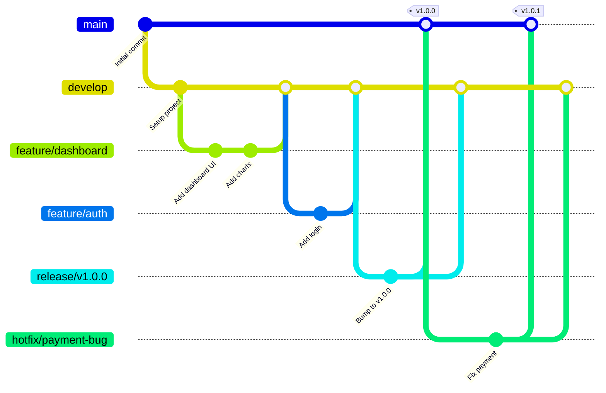

# Gitflow Workflow - CeroCloud

Este documento describe el flujo de trabajo Git utilizado en el proyecto **CeroCloud**.

---

## 📋 Estructura de Ramas

### Ramas Principales (Permanentes)

#### `main` - Producción
- **Propósito:** Código en producción, siempre estable
- **Releases:** Solo desde esta rama se crean releases oficiales
- **Protección:** ✅ Branch protection habilitado
- **Merge desde:** `release/*` o `hotfix/*` únicamente
- **CI/CD:** 
  - ✅ CI completo (lint, type-check, build)
  - ✅ CD automático (crea releases con semantic-release)

#### `develop` - Desarrollo
- **Propósito:** Rama de integración, código en desarrollo activo
- **Protección:** ✅ Requiere PR con revisión
- **Merge desde:** `feature/*`, `hotfix/*`
- **CI/CD:**
  - ✅ CI completo
  - ✅ Beta pre-releases opcionales (v1.0.0-beta.1)

---

### Ramas Temporales (Se eliminan después del merge)

#### `feature/*` - Nuevas Características
- **Convención:** `feature/nombre-descriptivo`
- **Ejemplos:**
  - `feature/user-authentication`
  - `feature/export-pdf-invoices`
  - `feature/multi-currency-support`
- **Origen:** Se crean desde `develop`
- **Destino:** Se fusionan a `develop` mediante PR
- **CI/CD:** ✅ CI automático en cada push

**Flujo:**
```bash
# Crear feature desde develop
git checkout develop
git pull origin develop
git checkout -b feature/nombre-caracteristica

# Trabajar en la feature...
git add .
git commit -m "feat: agregar nueva característica"

# Push y crear PR a develop
git push origin feature/nombre-caracteristica
# Crear PR en GitHub: feature/nombre-caracteristica → develop
```

---

#### `release/*` - Preparación de Releases
- **Convención:** `release/v1.x.x`
- **Ejemplos:**
  - `release/v1.1.0`
  - `release/v2.0.0`
- **Origen:** Se crean desde `develop`
- **Destino:** Se fusionan a `main` Y `develop`
- **Propósito:** Ajustes finales antes del lanzamiento

**Flujo:**
```bash
# Crear release branch desde develop
git checkout develop
git pull origin develop
git checkout -b release/v1.1.0

# Actualizar versión en package.json, changelog, etc.
npm version 1.1.0 --no-git-tag-version
git add package.json package-lock.json
git commit -m "chore: bump version to 1.1.0"

# Merge a main (crea release automático)
git checkout main
git pull origin main
git merge --no-ff release/v1.1.0
git push origin main

# Merge de vuelta a develop
git checkout develop
git merge --no-ff release/v1.1.0
git push origin develop

# Eliminar rama temporal
git branch -d release/v1.1.0
git push origin --delete release/v1.1.0
```

---

#### `hotfix/*` - Correcciones Urgentes
- **Convención:** `hotfix/descripcion-bug`
- **Ejemplos:**
  - `hotfix/fix-payment-crash`
  - `hotfix/security-vulnerability`
- **Origen:** Se crean desde `main`
- **Destino:** Se fusionan a `main` Y `develop`
- **Propósito:** Correcciones críticas en producción

**Flujo:**
```bash
# Crear hotfix desde main
git checkout main
git pull origin main
git checkout -b hotfix/fix-critical-bug

# Corregir el bug
git add .
git commit -m "fix: corregir bug crítico en pagos"

# Incrementar versión patch
npm version patch --no-git-tag-version

# Merge a main
git checkout main
git merge --no-ff hotfix/fix-critical-bug
git push origin main

# Merge a develop
git checkout develop
git merge --no-ff hotfix/fix-critical-bug
git push origin develop

# Eliminar rama
git branch -d hotfix/fix-critical-bug
git push origin --delete hotfix/fix-critical-bug
```

---

## 🔄 Flujo Completo de Trabajo



---

## 🚀 CI/CD Pipeline

### Continuous Integration (CI)
**Ejecuta en:** Todas las ramas (`main`, `develop`, `feature/*`, `hotfix/*`, `release/*`)

**Checks:**
- ✅ Linting (ESLint)
- ✅ Type Checking (TypeScript)
- ✅ Build exitoso (Vite)

**Plataformas:** Windows + Linux

---

### Continuous Deployment (CD)

#### Production Release (main)
- **Trigger:** Push a `main` o tag `v*.*.*`
- **Acción:** Crea release oficial en GitHub
- **Archivos:** Instaladores Windows (.exe), Linux (.AppImage, .deb)
- **Versión:** Según Semantic Versioning

#### Beta Pre-release (develop)
- **Trigger:** Push a `develop` (opcional)
- **Acción:** Crea pre-release con etiqueta `-beta`
- **Versión:** `v1.0.0-beta.1`, `v1.0.0-beta.2`, etc.

---

## 📝 Convención de Commits (Conventional Commits)

Seguimos **Conventional Commits** para generar changelogs automáticos:

### Tipos de Commits
- `feat:` Nueva característica → MINOR version (1.0.0 → 1.1.0)
- `fix:` Corrección de bug → PATCH version (1.0.0 → 1.0.1)
- `docs:` Solo documentación
- `style:` Formato, punto y coma, etc.
- `refactor:` Refactorización de código
- `perf:` Mejoras de rendimiento
- `test:` Agregar o corregir tests
- `chore:` Mantenimiento general
- `ci:` Cambios en CI/CD
- `build:` Cambios en build system

### Breaking Changes
```bash
git commit -m "feat!: cambio que rompe compatibilidad

BREAKING CHANGE: descripción del cambio"
```
→ MAJOR version (1.0.0 → 2.0.0)

---

## 🛡️ Protección de Ramas

### `main`
- ✅ Requiere pull request
- ✅ Requiere revisión de código
- ✅ Requiere CI passing
- ✅ No permitir force push
- ✅ No permitir eliminación

### `develop`
- ✅ Requiere pull request
- ✅ Requiere CI passing
- ✅ No permitir force push

---

## 📦 Release Checklist

Antes de crear un release desde `release/*` a `main`:

- [ ] Todos los tests pasan
- [ ] Versión actualizada en `package.json`
- [ ] Changelog actualizado con nuevas características
- [ ] Documentación actualizada
- [ ] Build exitoso en Windows y Linux
- [ ] PR revisado y aprobado

---

## 🔗 Referencias

- [Gitflow Workflow](https://www.atlassian.com/git/tutorials/comparing-workflows/gitflow-workflow)
- [Conventional Commits](https://www.conventionalcommits.org/)
- [Semantic Versioning](https://semver.org/)

---

*Última actualización: 8 de Enero de 2026*
